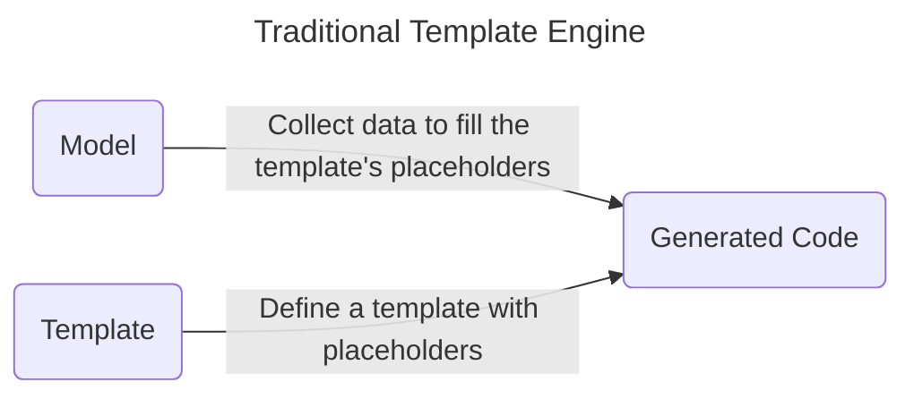
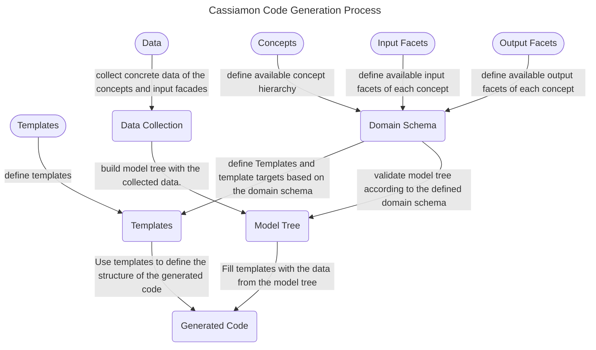
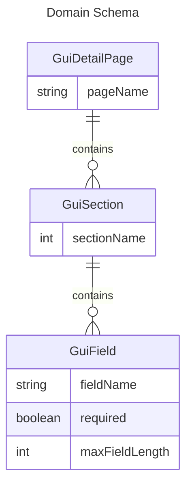
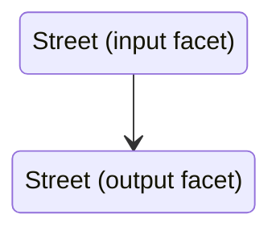
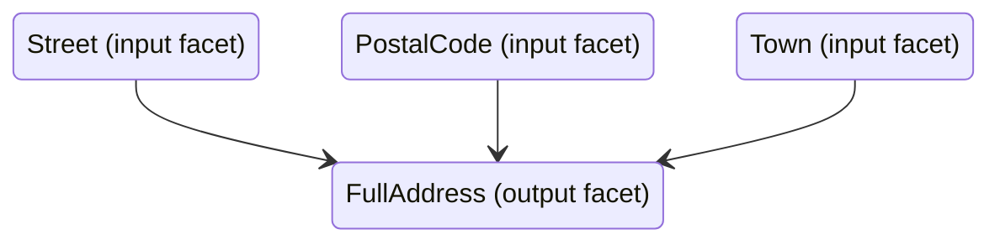

# Cassiamon Code Generation

Cassiamon is in its core a template engine to generate source code.

Let's have a look what a traditional template engine is doing:

To support code generation better, cassiamon has some additional key concepts during the process of code generation.

TODO Write something about type safety
TODO Write something about the separation of the input and the output model (input facades/output facades)
TODO Write something about schema and typesafe transformation of input to output facades

# Example to introduce the main keywords

Let's assume that we want to build the source code for a simple graphical user interface (GUI) to manage person-related information like people and the companies they are working for. We want to generate our source code automatically based on some definitions we hold in an XML file.

## Define the Domain Schema (Concept, Input Facets)
First we define the main concepts we need for our simple application and what data can be provided per concept:
1. _GuiDetailPage_ concept: The detail page shows all information about one entity, e.g. one page with all information about a person or one page with all information about a company. 
2. _GuiSection_ concept: One page can have multiple sections, e.g. on the person page you have the section "names", the section "address" to group the different fields.
3. _GuiField_ concept: One Section can have multiple fields, e.g. the field "firstname", the field "lastname", "street", "postalCode", "city", "country"

The keywords:
* This whole definition is called the **_DomainSchema_**. 
* The DomainSchema contains **_Concepts_** like GuiDetailPage, GuiSection, GuiField.
* Each **_Concept_** can have multiple (Input=)**_Facets_** like pageName, sectionName, fieldName, required, maxFieldLength.

## Define the Data Collector
A data collector is a source (like e.g. an XML file or a JSON file) that provide the information to fill out the DomainSchema with concrete data.

Looking to the example from above, this input data might be:

| Concept       | Concept-Id       | Parent Concept-Id | Facettes                                                               |
|---------------|------------------|-------------------|------------------------------------------------------------------------|
| GuiDetailPage | "PersonPage"     | -                 | pageName="Person Page"                                                 |
| GuiDetailPage | "CompanyPage"    | -                 | pageName="Company Detail Page"                                         |
| GuiSection    | "NameInfo"       | "PersonPage"      | sectionName="All names"                                                |
| GuiSection    | "AddressInfo"    | "PersonPage"      | sectionName="Address of the Person"                                    |
| GuiField      | "firstnameField" | "NameInfo"        | fieldname="Firstname"  required=true  maxFieldLength=40        |
| GuiField      | "lastnameField"  | "NameInfo"        | fieldname="Lastname"  required=true  maxFieldLength=40         |
| GuiField      | "street"         | "AddressInfo"     | fieldname="Street"  required=false  maxFieldLength=255         |
| GuiField      | "postalCode"     | "AddressInfo"     | fieldname="Postal Code/Zip"  required=false  maxFieldLength=10 |
| GuiField      | "town"           | "AddressInfo"     | fieldname="Town"  required=false  maxFieldLength=40            |

You define here the concrete model instances of the concepts (always uniquely identified with a concept id) and the input facets of each concept.
The data you define here must conform the DomainSchema, otherwise you will get an error, when importing this data.

## Define the Output Facets

Also part of the DomainSchema are the output facets.

While the input facets define the permitted data for the data collector, the output facets define, what values are accessible in the templates.

The most straightforward output facet is the one that takes an input facet and providing it without changes.

But you can freely define output facets transforming the input of one or more input facet to a new value.

Examples of such transformation are: 
* output an input facade in uppercase character and with underlines. The input facade "entityName" is transformed to an output facade "databaseTableName" that must be uppercase and must not contain spaces in it but underlines. 
* concatenate two or more input facades to a output facade. The input facade "packageName" and "className" is concatenated to an output facade "fullQualifiedName".

## Define the Templates

# Extend the framework

### Extension
An extension adds new capabilities to the code generator like. Here are some examples:
* xml-schemagic: Adds the capability to read from XML files. Fill out the XML file is supported by an generated XSD (=XML schema) out from the cassiamon schema.
* freemarker-templates: Adds the capability to use the [freemarker template language](https://freemarker.apache.org/) to write the templates.

### Domainunits (former: Plugin/Addon)
With addons, you define the following three parts:
1. Schema: The schema itself
2. Input Source: How data is filled in the schema.
3. Templates: How data is used to generate files.

# Keyword Glossary

### Domain Schema

The _domain schema_ holds the _concepts_, its input facades and its output facades.

### Concept
The _concept_ is the main element to structure items in a hierarchical way. A _concept_ may have a parent _concept_ and may have one or multiple child _concepts_.

With a _concept_, you can represent whatever you can build code for, like ...
* A database table.
* A database field (as a child of a database table).
* A UI (=user interface) section to group multiple fields together.
* A field in the UI (e.g. as child element of an ui section to group fields).
* A description of a cache.
* A description of a technical interface like a REST-Endpoint.

### Input Facet

A _facet_ make it possible to add all kind of values to a concept. Each _facet_ belongs exactly to one _concept_.

Examples:
If we have the _concept_ "SqlDatabaseTable", we want to add a facet "tableName" to provide a name for the database table.
If we have the _concept_ "SqlDatabaseField", we want to add a facet "fieldName" to provide a name for the database field and another facet "fieldType" to provide information whether this database field contains text, numbers or timestamps.

The facet itself can have only the following values:
* A text
* A boolean (=yes/no) value 
* A number value. Only non-floating values are supported.
* An enumeration, that means one value from a set of predefined values.
* A directory
* A file

### Template

A _template_ describes a file that is generated. It contains placeholders that will be replaced with concrete values. Templates can generate all kind of files, e.g. a java file, XML or JSON files, an HTML file, etc.

With a _template_, you describe the real code of a file like ...
* an SQL database script with CREATE TABLE statements. The names of the tables are placeholders that will be filled out dynamically.
* a java DAO file that contains the fields of a database table and is named with the table name.
* an angular or react component to visualize a certain text field like the firstname or lastname of a person. 
* an angular or react component to group different field (firstname and lastname of a person) together as a UI section.
* an angular or react component to provide a navigation for a list of navigation entries.

#### Template Target
A template target is the combination of a template and the file location (file path and file name) where the resolved content of the template is written to. 

### Model Tree / Model Graph
The model tree represents all the concepts, its purposes and its facets as a hierarchical tree structure.
The class itself is mutable to build the tree but can be passed to other methods in an immutable form (similar as List and MutableList in Kotlin).

